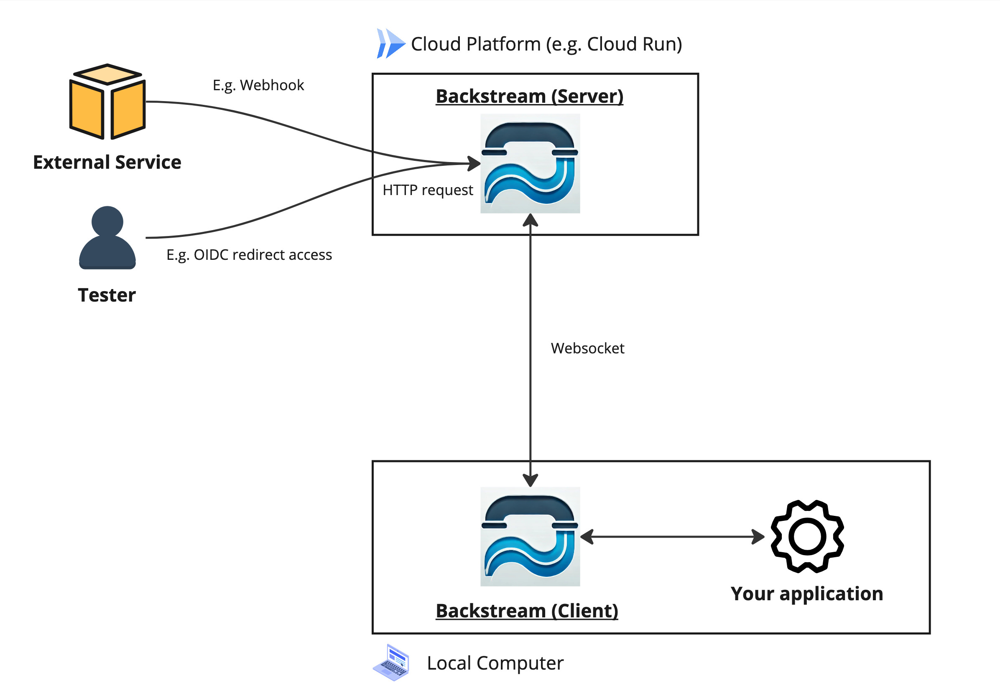

# backstream

Expose your local applications to the internet with a self-hosted reverse proxy.



The backstream provides a straightforward method to expose your local applications to the internet. It is a self-hosted reverse proxy that allows you to access your local applications from anywhere. It is particularly useful for:

- **Testing Webhooks from External Services**: By exposing your local applications to the internet, you can test webhooks from external services.
- **Testing Web Applications on the Internet**: You can test web applications on the internet with your web browser, which is necessary for certain web applications that require internet access.
- **Easy Access to Local Applications with TLS**: Some authentication mechanisms necessitate a TLS connection to your application. You can set up your own TLS server using a cloud platform (e.g., Cloud Run) and backstream.

## Motivation

This feature is similar to [ngrok](https://ngrok.com/), [localtunnel](https://localtunnel.github.io/www/), and [serveo](https://serveo.net/). However, backstream is a self-hosted reverse proxy that you can run on your own server. It is open-source and free to use.

- **Security**: Your data never leaves your server. You don't have to rely on third-party services, allowing you to handle sensitive data (credentials, personal information) on your server.
- **Custom Domain**: You can use your own domain name. Set up a subdomain like `app.example.com` to access your local application.

## Usage

### Deploy Server

First, deploy the server. It can be done in any environment, but please take note of the following points. The developer recommends using [Cloud Run](https://cloud.google.com/run).

- This implementation does not support HTTPS. If you want to use HTTPS, use middleware like nginx or the features of a cloud platform.
- Ensure the server runs with only one process. It will not function correctly if requests are split across multiple processes using load balancers.

Create and deploy a Dockerfile as shown below:

```Dockerfile
FROM ghcr.io/m-mizutani/backstream:latest # Or specify tag or digest

# Open port 8080
ENV BACKSTREAM_ADDR="0.0.0.0:8080"

# Use JSON log format
ENV BACKSTREAM_LOG_FORMAT="json"

# Expose port 8080
EXPOSE 8080

ENTRYPOINT ["/backstream", "serve"]
```

Let's assume it is deployed to https://backstream-0000000000.asia-northeast1.run.app.

### Run Client

Once deployment is complete, connect to the server as follows:

```bash
% backstream client -s https://backstream-0000000000.asia-northeast1.run.app -d http://localhost:8080
```

Specify the server URL with `-s` and the URL of the local application you want to send requests to with `-d`. Upon successful connection, the following message will be displayed:

```
12:38:22.907 INFO connected to server url="wss://backstream-0000000000.asia-northeast1.run.app"
```

Now, accessing `https://backstream-0000000000.asia-northeast1.run.app` will forward the request to `http://localhost:8080`, and the response will be returned.

## Authentication & Authorization

Backstream supports authentication and authorization. You can freely configure these settings using [Rego](https://www.openpolicyagent.org/docs/latest/), a general-purpose policy description language. When starting in `serve` mode, specify a directory with the `-p` option to recursively load `*.rego` files.

You can specify two packages: `auth.client` and `auth.server`.

> [!WARNING]
> When specifying policies with the `-p` option, ensure you include both `auth.client` and `auth.server`. The default setting is `allow = false`, so without specified policies, connections won't be possible.

Below is an example of using the `auth.client` package to restrict clients that can connect to backstream.

```rego
package auth.client

allow if {
    input.header.Authorization == "Bearer your_token"
}
```

- `package auth.client`: This must be stated at the beginning.
- `allow`: If policies are set, requests will only go through when this is `true` (default is `false`).

The above example demonstrates how to authenticate and authorize using a fixed token. When connecting from a client, specify the token in the header during server connection using the `-H` option, as shown below:

```
% backstream client -s https://backstream-0000000000.asia-northeast1.run.app -d http://localhost:8080 -H "Authorization: Bearer your_token"
```

For more detailed information, refer to [doc/policy.md](doc/policy.md).

## License

Apache License 2.0